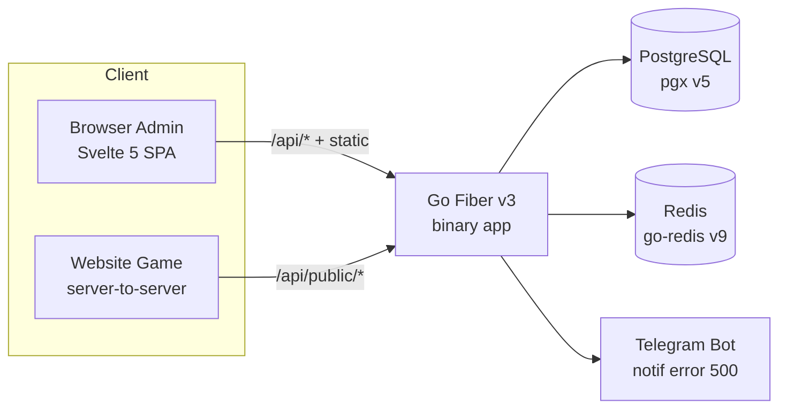
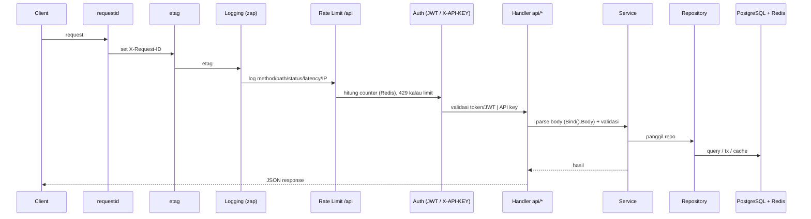
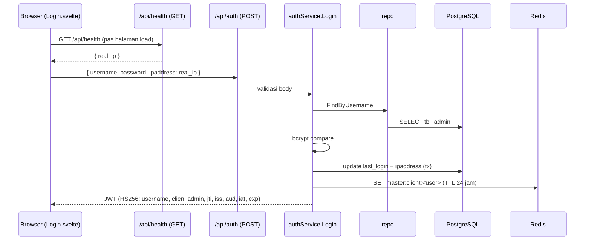
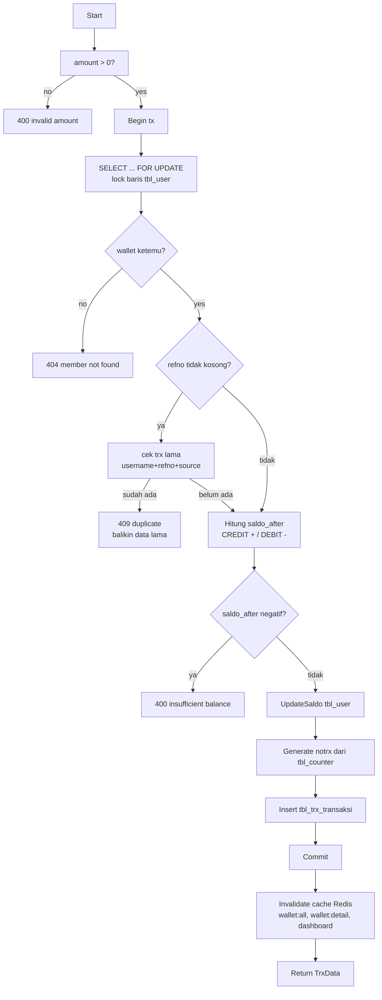
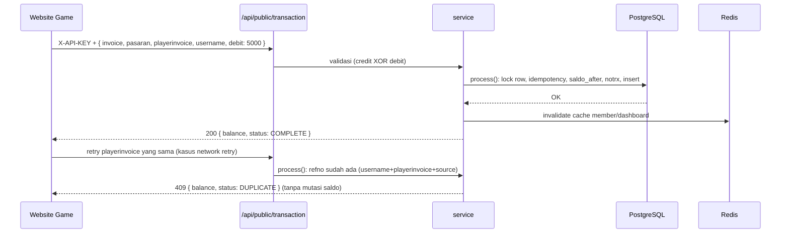
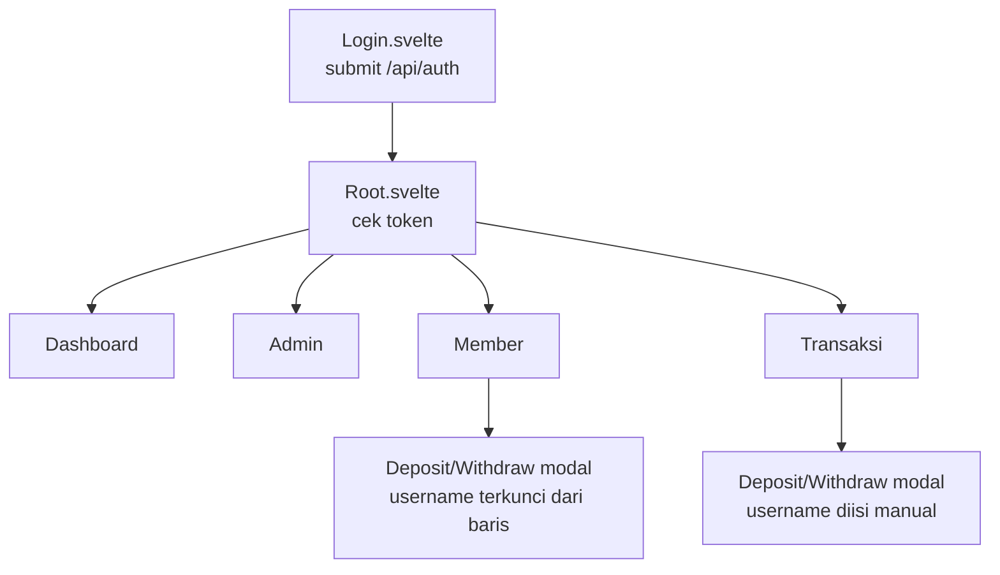

# Wallet API — Arsitektur & Business Flow

Dokumen pendamping `documentasi.md`. Fokus: **bagaimana sistem dibangun** (arsitektur) dan
**alur-alur bisnis inti** (business flow) dari aplikasi wallet (top-up / taruhan / riwayat).

Tech stack & versi aktif (cek `go.mod`): Go 1.25, Fiber v3, pgx v5, go-redis v9,
Svelte 5 + Vite + Tailwind. Deploy: Docker image → Cloud Run.

---

## 1. Gambaran Umum

Satu **monolith Go** yang melakukan dua pekerjaan sekaligus:

1. **REST API** (`/api/*`) untuk admin panel (JWT) dan website game eksternal (X-API-KEY).
2. **Serve SPA frontend** (`web2026/dist` — hasil build Svelte) sebagai static files.

Jadi Cloud Run cuma jalanin satu binary `app` yang isi API + dashboard sekaligus.



---

## 2. Arsitektur Backend

### 2.1 Layering (dependensi hanya ke arah bawah)

```
domain/        → kontrak: struct entity + interface repository & service
dto/           → request/response JSON API
internal/repository/ → query SQL (pgx v5), transaksi DB
internal/service/     → business logic, transaksi DB, idempotency, cache Redis
internal/api/         → handler Fiber (HTTP), middleware, wiring route
internal/connection/  → koneksi DB/Redis, logger (zap), notif Telegram
internal/config/      → load env (.env / environment)
internal/util/        → helper (hash password, validasi, counter, enkripsi)
main.go               → bootstrap: config → DB → Redis → Fiber app → route → Listen
```

Aturan: `api` cuma manggil `service` (via interface `domain`), `service` cuma manggil
`repository`, `repository` cuma SQL. Bukan dependency-injection framework — semua
di-wire manual di `main.go`.

### 2.2 Alur request (middleware chain)



Urutan pemasangan di `main.go`:

1. `requestid.New()` — ID unik per request (`X-Request-ID`).
2. `etag.New()` — cache header response.
3. Logging middleware custom — log method, path, status, latency, IP, request_id.
4. `app.Use("/api", limiter)` — rate limit global per IP, counter di Redis.
5. `app.Use("/", static.New("./web2026/dist"))` — serve SPA (statis; API tetap jalan karena
   static melempar ke `next()` kalau bukan file).
6. Route groups — admin/JWT, public/X-API-KEY.
7. `api.NewHealthCheckApi(app)` — `GET /api/health` **publik** (tanpa JWT/API key): habis
   limiter langsung ke handler, tidak lewat middleware auth.

Catatan: `/api/health` dipanggil frontend saat halaman Login pertama load buat nangkep **real IP**
client (dicek dari `c.IPs()`/X-Forwarded-For, fallback `c.IP()`, lihat `internal/api/health.go`).
IP itu dikirim sebagai field `ipaddress` di body `POST /api/auth` dan disimpan ke
`tbl_admin.ipaddress` (schema `varchar(70)`).

### 2.3 Middleware autentikasi (dua jalur)

| Jalur | Route | Kredensial | Middleware |
|---|---|---|---|
| Admin panel | `/api/admin`, `/api/member`, `/api/transaksi`, `/api/dashboard`, `/api/auth/*` | `Authorization: Bearer <JWT>` | JWT middleware (contrib v3, HS256) |
| API publik | `/api/public/*` | Header `X-API-KEY` | `ApiKeyMiddleware` (`internal/api/middleware.go`) |

JWT middleware (`main.go`): setelah token valid, di `SuccessHandler`:

- Ambil token via `jwtware.FromContext(c)` (contrib v3 — **bukan** `c.Locals("user")`).
- Validasi claim `clien_admin` (username admin), `jti` (harus ada), cek **blacklist** di Redis,
  lalu cek `iss`/`aud` sesuai config.
- Set `c.Locals("client_username", username)` → dipakai handler sebagai `create_by`.

### 2.4 Data store

**PostgreSQL** (pgx v5, pool `connection.GetDatabase`):

| Tabel | Isi |
|---|---|
| `tbl_admin` | Akun admin panel (password bcrypt) |
| `tbl_user` | Member/wallet — `username`, `token` (UUID, buat lookup balance), `saldo`, status |
| `tbl_trx_transaksi` | Ledger mutasi saldo: `username`, `tipe`, `source`, `amount`, `saldo_before/after`, `refno`, `notrx`, `status`, `keterangan`, `create_by/at` |
| `tbl_counter` | Counter `NOTRX_TRANSAKSI` → generate `notrx` (`TRX-000001`) |

Constraint penting (mirror di service): `tbl_user_saldo_ck` (saldo tidak boleh negatif),
`tbl_trx_tipe_source_ck` (pasangan tipe+source terbatas).

**Redis** (go-redis v9, satu koneksi `connection.RDB`):

| DB | Isi |
|---|---|
| `DB_REDIS_NAME` (biasanya 2) | Cache umum: admin, member, riwayat transaksi, JWT blacklist, rate limit |
| 3 | Cache dashboard (`wallet:dashboard:v2`, `wallet:dashboard:chart`) — sengaja terpisah biar gampang di-flush |

Key cache utama:
- `master:admin:all` — list admin (TTL 1 menit)
- `master:client:<username>` — data session admin (TTL 24 jam)
- `wallet:all`, `wallet:detail:<username>` — list/detail member (TTL 1 menit)
- `wallet:trx:history:<username|all>:<tipe>:<limit>:<offset>` — halaman riwayat (TTL 1 menit)
- `wallet:trx:count:<username|all>` — total riwayat (TTL 1 menit)
- `wallet:dashboard:v2`, `wallet:dashboard:chart` — dashboard (TTL 1 jam, DB 3)
- `master:jwt:blacklist:<jti>` — token logout (TTL = sisa umur token)
- Rate limit disimpan fiber limiter di DB yang sama (prefix `lr:`)

Koneksi Redis yang sama juga dipakai sebagai storage rate limiter via adapter `FiberRedisStorage`
di `internal/connection/fiber_storage.go` (mengimplementasikan `fiber.Storage` dengan go-redis
langsung — **tidak pakai** package storage dari gofiber).

---

## 3. Business Flow

### 3.1 Login admin & sesi



- Real IP diambil dari `/api/health` (publik, header anti-cache, lihat §2.2) — bukan dari
  sisi server `/api/auth` karena `c.IP()` di belakang proxy/Cloud Run bisa berubah jadi IP
  internal. `dto.AuthRequest.Ipaddress` bersifat `required`, jadi kalau `fetch` health gagal,
  frontend tetap kirim `"0.0.0.0"`.

- Rate limit `/api/auth` = **20 request/menit/IP** (anti brute force).
- Logout (`/api/auth/logout`): ambil `jti` dari token → `SET master:jwt:blacklist:<jti>`
  dengan TTL sisa umur token. JWT middleware menolak token yang jti-nya kena blacklist.
- Frontend: `src/lib/api.ts` (`apiFetch`) auto kirim `Authorization: Bearer`, dan kalau
  backend balas **401** → `setToken(null)` → langsung render halaman Login (auto-logout).

### 3.2 Rate limiting global

- `app.Use("/api", limiter)` — default **300 request/menit per IP**, counter di Redis
  (konsisten antar instance / restart). Konfigurasi: `RATE_LIMIT_MAX` / `RATE_LIMIT_EXP`.
- Kena limit → `429 too many requests`.
- `/api/auth` punya limiter terpisah yang lebih ketat (lihat 3.1).

### 3.3 Manajemen member (admin panel)

- `/api/member` — list member (cache `wallet:all`, TTL 1 menit).
- `/api/member/save` dengan `type`:
  - **New**: validasi password min 6 karakter, insert member; `token` member digenerate
    **UUID** otomatis (buat lookup `/api/public/balance`).
  - **Edit**: update nama/status, tidak menyentuh password.
- Semua create/update tercatat `create_by` dari `client_username` (dari JWT).

### 3.4 Mutasi saldo — inti sistem (Deposit / Withdraw / Win / Payout)

Semua mutasi saldo lewat satu fungsi: `service.process()` (`internal/service/wallet_transaction.go`).
Empat pintu masuk memanggil fungsi yang sama:

| Endpoint | tipe | source | create_by |
|---|---|---|---|
| `/api/transaksi/deposit` (admin) | CREDIT | DEPOSIT | username admin |
| `/api/transaksi/withdraw` (admin) | DEBIT | WITHDRAW | username admin |
| `/api/public/transaction` credit>0 | CREDIT | WIN | `public-api` |
| `/api/public/transaction` debit>0 | DEBIT | BET | `public-api` |

Alur `process()` — **semua dalam satu DB transaction**:



Poin penting:

1. **Anti race condition**: baris wallet dikunci `SELECT ... FOR UPDATE` sebelum hitung saldo.
   Dua transaksi konkuren untuk username yang sama otomatis antre.
2. **Idempotency**: kalau `refno` + `username` + `source` sudah pernah diproses → transaksi
   lama dikembalikan **tanpa** mutasi saldo. Scope-nya **per source** supaya `playerinvoice`
   yang sama boleh dipakai untuk 1 BET **dan** 1 WIN (satu bet-slip: kena taruhan dulu,
   menang belakangan) — dua-duanya tercatat. Duplikat jenis sama → `409`.
3. **Saldo tidak boleh minus** — dicek di service (mirror `tbl_user_saldo_ck`).
4. `notrx` unik dari `tbl_counter` (`TRX-%06d`).
5. Setelah commit → invalidate cache (list member, dashboard) lewat goroutine.

### 3.5 API publik website game (`/api/public/*`)

Dipanggil **server-to-server**, diamankan header `X-API-KEY`, **bukan** JWT browser.

**POST `/api/public/transaction`** — lapor hasil game:
- Wajib **persis satu** dari `credit`/`debit` > 0 → credit = WIN (CREDIT), debit = BET (DEBIT).
- `invoice` = ID draw, boleh diulang (satu draw banyak bet-slip).
- `playerinvoice` = kunci idempotency (`refno`), unik per bet-slip.
- `invoice`+`pasaran` disimpan gabungan di kolom `keterangan`.
- Response sukses **synchronous**: `{ invoice, playerinvoice, username, balance, status: "COMPLETE" }`
  — begitu balik `200`, saldo sudah final di DB. Duplikat → `409` dengan `status: "DUPLICATE"`.

**POST `/api/public/balance`** — cek username + saldo via `token` member (UUID dari `tbl_user.token`).

Alur pengiriman game → wallet untuk satu taruhan:



### 3.6 Dashboard admin

`/api/dashboard` (JWT): ringkasan kartu statistik + chart 12 bulan.

- Kartu: total deposit/withdraw/debit hari ini (jam Jakarta), total member, total transaksi.
  - `total_debit_today` khusus `source = 'BET'` (beda dari "total withdraw").
- Chart: `GROUP BY to_char(create_at,'YYYY-MM')` untuk 12 bulan terakhir, diisi `0.00` untuk
  bulan kosong biar sumbu chart selalu penuh.
- Cache terpisah di Redis **DB 3**: `wallet:dashboard:v2` (kartu) & `wallet:dashboard:chart`
  (chart), TTL 1 jam. Setiap mutasi saldo invalidate `wallet:dashboard:v2`.
- Frontend render pakai LayerChart v2 (shadcn-svelte BarChart).

### 3.7 Notifikasi error (Telegram)

- Server error (500) → kirim pesan ke Telegram (`internal/connection/telegram.go`).
- Hanya error server (query DB gagal, koneksi putus, bug), **bukan** error bisnis
  (400/401/404/409) — biar tidak spam.
- Data sensitif (password, token) tidak pernah dikirim ke notifikasi.
- Env: `TELEGRAM_BOT_TOKEN` / `TELEGRAM_CHAT_ID` (kosong = nonaktif).

### 3.8 Flow frontend (SPA)



- Semua request lewat `apiFetch` (`src/lib/api.ts`) → header Bearer otomatis.
- Response **401** → auto-logout (token dihapus, kembali ke Login).
- Tiap fitur: `<Fitur>.svelte` (data via hook `use<Fitur>.ts`) + `Home.svelte` (tabel & form).

---

## 4. Deployment (Cloud Run)

```
web2026/  ──npm run build──▶ web2026/dist
Go module ──go build .────▶ app
```

Dockerfile 3 stage (lihat `documentasi.md` §6): build SPA → build Go (`go build -o app .`)
→ image final `alpine` berisi binary + `web2026/dist`. Cloud Run jalanin `./app` dengan
`PORT` dari platform; env diisi lewat dashboard Cloud Run (bukan di-baked ke image).

```
docker build -t wallet-api .
docker run -p 6167:6167 --env-file .env wallet-api
```

---

## 5. Daftar File Kunci

| Area | File |
|---|---|
| Bootstrap | `main.go` (Fiber v3, middleware, route, JWT, limiter) |
| Handler | `internal/api/admin.go`, `auth.go`, `dashboard.go`, `wallet.go`, `wallet_transaction.go`, `wallet_public.go`, `health.go`, `middleware.go` |
| Business logic | `internal/service/admin.go`, `auth.go`, `dashboard.go`, `wallet.go`, `wallet_transaction.go` |
| Query | `internal/repository/*.go` |
| Koneksi | `internal/connection/database.go`, `redis.go`, `telegram.go`, `fiber_storage.go` |
| Config | `internal/config/` |
| Kontrak | `domain/`, `dto/` |
| Frontend | `web2026/src/` (`lib/api.ts`, `lib/use*.ts`, `Login.svelte`, `dashboard/`, `admin/`, `member/`, `transaksi/`, `components/DepositWithdrawModal.svelte`) |
